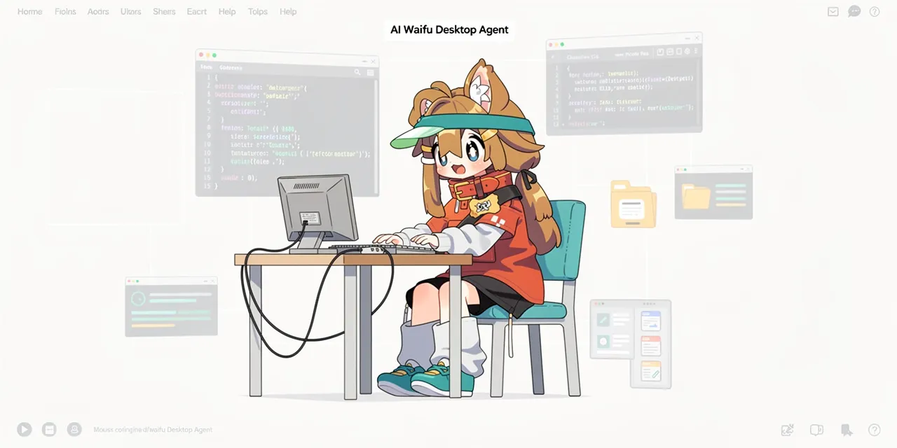

  

# Your Waifu. On your desktop. Actually useful.

A 3D-rendered desktop AI assistant that **sees you, talks to you, and gets shit done** — voice-first, real-time, zero latency feel.

She moves. She dances. She lip-syncs every word. Powered by realtime speech-to-speech models like **Qwen Omni** (and soon **Grok**), she's the agent that codes, browses, and controls your machine — all through voice, all through her.

---

## What she can (eventually) do

- **Real-time voice convos** — speech-to-speech, no janky STT→LLM→TTS pipeline
- **Code** — writes, runs, debugs. Voice-controlled coding agent
- **Browse the web** — opens pages, fills forms, scrapes data
- **Control your PC** — files, apps, scripts, automation
- **3D avatar** — renders in the app window with full lip-sync and idle animations

## Skills (the fun stuff)

| Skill | Status |
|---|---|
| **Teacher Mode** — quizzes you, explains concepts, adapts to your pace | In dev |
| **Second Brain** — remembers everything, resurfaces context, builds your knowledge graph | Planned |
| **Language Learning Partner** — realtime conversation practice with corrections | Planned |
| **Secretary Mode** — calendar, email, reminders, scheduling | Planned |
| **Game Mode** — plays games with you. Trivia, word games, full AI-hosted RPGs | Planned |

---

## Stack

- **Frontend**: Tauri + Vite + React + TypeScript + MobX + Three.js
- **Backend**: Rust — mic capture, wake word, WebSocket proxy, speaker playback
- **Speech-to-speech**: Qwen Omni Realtime API (Grok coming)
- **Wake word**: livekit-wakeword (trained custom "Kassandra" model)
- **Dev env**: Fully Dockerized (Rust, Bun, Tauri CLI — zero host pollution)

---

## What works today :white_check_mark:

- Wake word detection ("Kassandra") via custom ONNX model
- Full Qwen Omni realtime integration — mic → cloud → speaker, end to end
- Semantic VAD, barge-in support
- Mute toggle, end call
- Dockerized dev environment with X11 GUI + PipeWire audio passthrough
- Tauri desktop shell with React/MobX UI
- Error boundary, routing scaffold, form validation scaffold

## What's next :construction:

- 3D waifu avatar rendering + lip-sync (Three.js / VRM)
- Grok realtime API integration
- Memory / RAG / context persistence
- Browser control agent
- PC control agent (file ops, scripting)
- Teacher Mode
- Personality system
- Game Mode
- Voice coding agent
- Skill plugin system
- Android support
